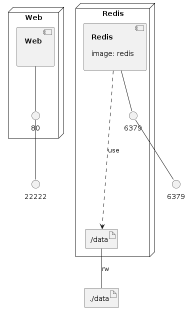

# DOCKER PRACTICA 2


## Contenedor Docker Compose de Python/Flask
1) Crear un nuevo repositorio con visibilidad pública en GitHub
* Nombre: `docker_python_compose`
* Descripción: `Ejemplo para contenedor Python con Redis usando Docker Compose`
2) Copiar los archivos desde la URL https://github.com/Juli-BCN/docker_python_compose
* Cada uno puede utilizar el método preferido para copiar como hacerlo a mano, usar un clon en Visual Studio (git clone + git push) o hacer un "Fork" desde GitHub
3) Modificar las línea 4 para agregar los valores personales de cada uno:
```
LABEL maintainer="JuliBCN <julibcn@gmail.com>"
```
4) Vamos a comprobar el contenido del archivo llamado `docker-compose.yml`:
```
version: "3"
services:
    web:
        build: .
        ports:
            - "4000:80"
    redis:
        image: redis
        ports:
            - "6379:6379"
        volumes:
            - "./data:/data"
        command: redis-server --appendonly yes
```
5) Primero instalamos `docker-compose` si no estuviese instalado, lo que podemos asegurar con el comando `docker-compose --version`:
> docker-compose --version

6) Vamos a probar a crear la apliación en 2 contenedores con el comando `docker-compose up` y ver qué pasa:
> docker-compose up -d --scale web=2
* Es normal que aparezca un error porque no tenemos recursos para ejecutar más de un servicio web en GitPod
* Dado el error, es lo mismo ejecutar simplemente `docker-compose up -d`
* El contador que se almacena en Redis ya funciona


## Parada del contenedor Docker Compose de Python/Flask
Para parar un contenedor en ejecución, primero hemos de saber el ID de dicho contenedor con el comando `docker ps`. Una vez averiguado, podemos pararlo con `docker stop`:
> docker ps

> docker stop XXXXXXXXXXXX


### Infrastructure model

